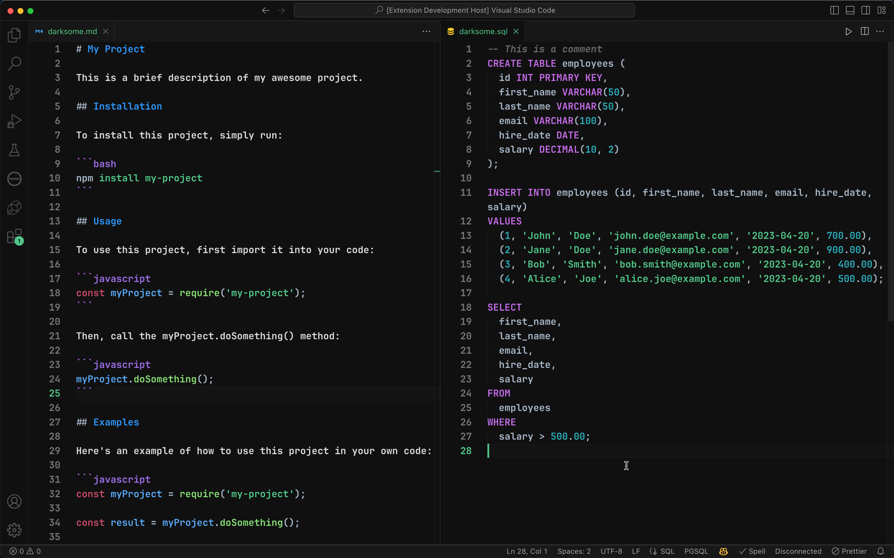

# Darksome - A Dark and Awesome Theme

A sleek and professional dark theme designed to reduce eye strain and fatigue while keeping your focus on your code. Become a highly productive developer with a theme that ensures your code is easy to read with clear and legible text overlaying rich shades of black and gray background. With a visually stunning syntax highlighting, Darksome makes it effortless to navigate through your codebase and distinguish different elements in your code with an accessibility complaint contrast ratio.

Happy coding! 🎉 🎉 🎉

[@rochekollie](https://twitter.com/rochekollie).

**Darksome is actively in development and is available for experimental use at this time**.

## Installation

1. Press F1.
2. Type "install".
3. Select "Extensions: Install Extension".
4. Search "Darksome" in the search box.
5. Click on Darksome theme to select from the list.
6. Click the "Install" button.
7. Click "Reload" to reload the editor.

## Screenshots

### HTML and CSS Syntax Highlighting

### JavaScript and JSON Syntax Highlighting

### Java and Python Syntax Highlighting

### Markdown and SQL Syntax Highlighting

## Features

- [x] UI Theme
- [x] Syntax Highlighting
- [x] Dark Theme
- [x] Accessibility Complaint Contrast Ratio

## Contributing

The only way to contribute to Darksome at this time is to create an issue on the [GitHub repository](https://github.com/rochekollie/darksome/issues). Please include a detailed description of the issue and screenshots if possible. Your issue may be features, bugs, or suggestions. However, your issue will
be closed if it does not include a detailed description and screenshots when necessary.
