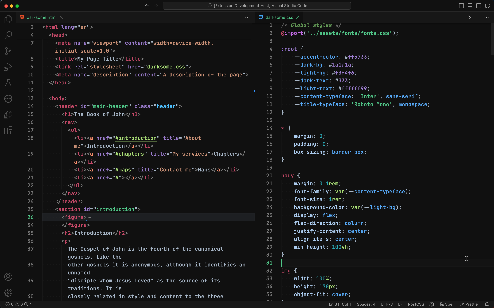
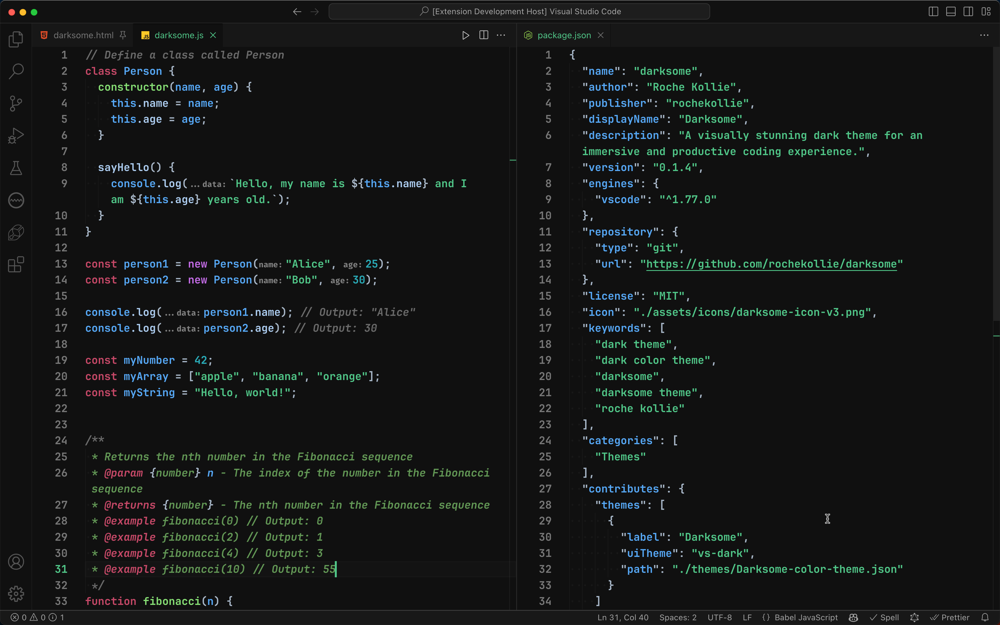
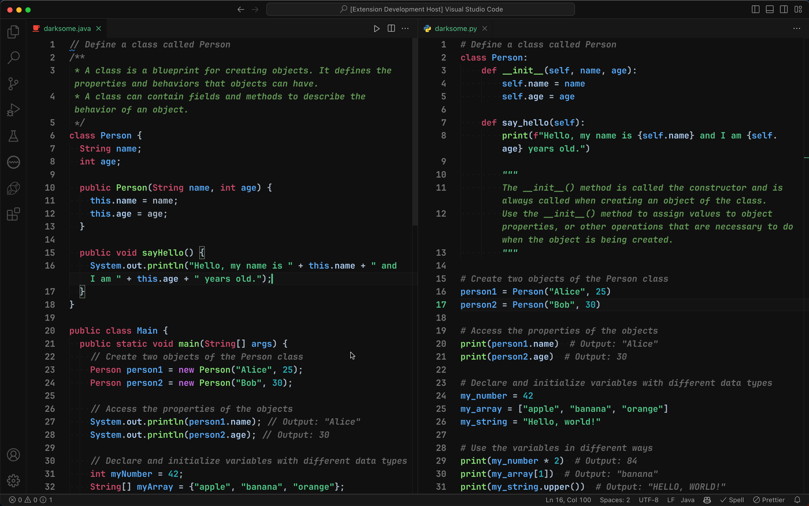

# Darksome - A Dark and Awesome Theme

A sleek and professional dark theme designed to reduce eye strain and fatigue while keeping your focus on your code. Become a highly productive developer with a theme that ensures your code is easy to read with clear and legible text overlaying rich shades of black and gray background. With a visually stunning syntax highlighting, Darksome makes it effortless to navigate through your codebase and distinguish different elements in your code with an accessibility complaint contrast ratio.

Enjoy, and happy coding!

[@rochekollie](https://twitter.com/rochekollie).

**Darksome is actively in development and is available for experimental use at this time**.

## Screenshots

### HTML and CSS Syntax Highlighting

### JavaScript and JSON Syntax Highlighting

### Java and Python Syntax Highlighting

## Installation

Instructions for installing from:

### Installing from Visual Studio Code

1. Open VS Code
2. Press F1
3. Type "install"
4. Select "Extensions: Install Extension".
5. Search "Darksome" from the list
6. Click "Install"
7. Click "Reload" to reload the editor

### Installing Visual Studio Marketplace

1. Search for "Darksome" in the Visual Studio Marketplace
2. Click the "Darksome" extension card from the search results
3. Click "Install"
4. On the Pop-up, click "Continue" to install the extension
5. On the Pop-up, click "Open Visual Studio Code" to open the editor
6. On the extension opened tab in the editor, click "Install" to install the extension
7. Click "Reload" to reload the editor

## Features

- [x] UI Theme
- [x] Syntax Highlighting
- [x] Dark Theme
- [x] Accessibility Complaint Contrast Ratio

## Contributing

**Darksome is actively in development, hence, contributions are welcome**.

To contribute to Darksome, please create an issue on the [GitHub repository](https://github.com/rochekollie/darksome/issues).
