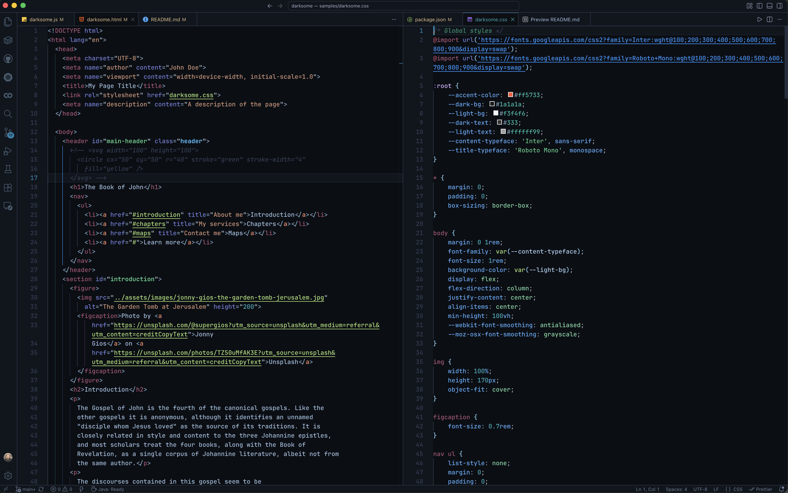
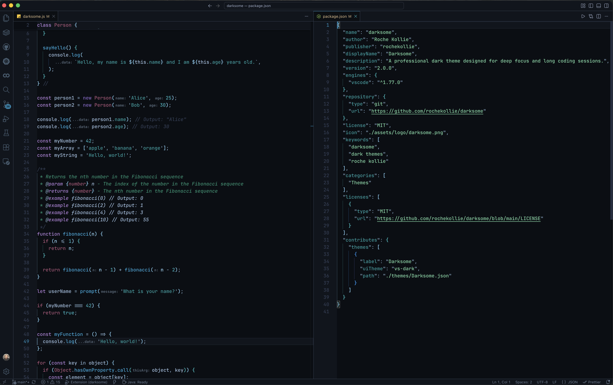
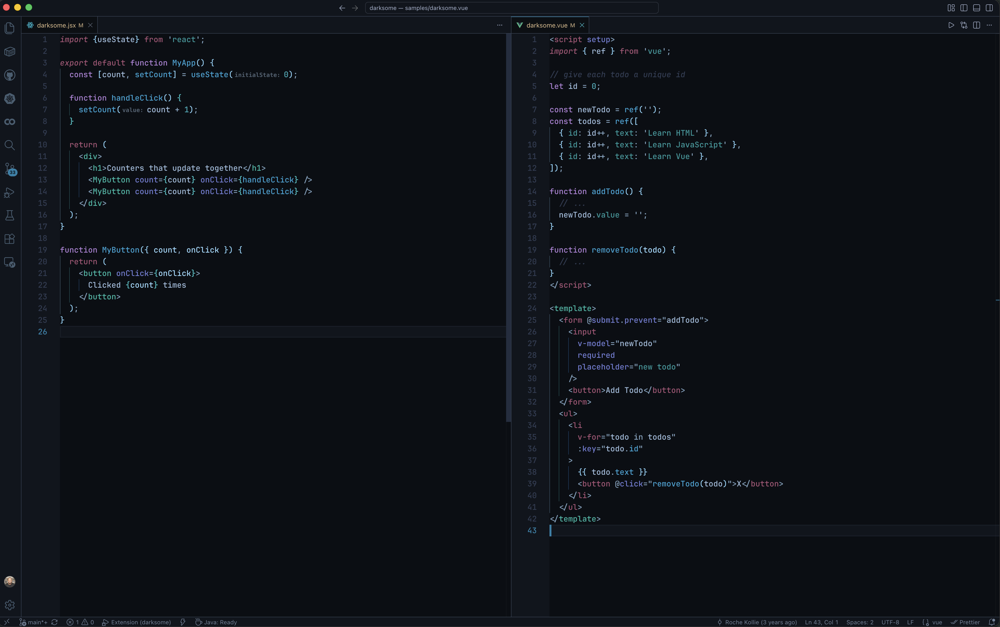
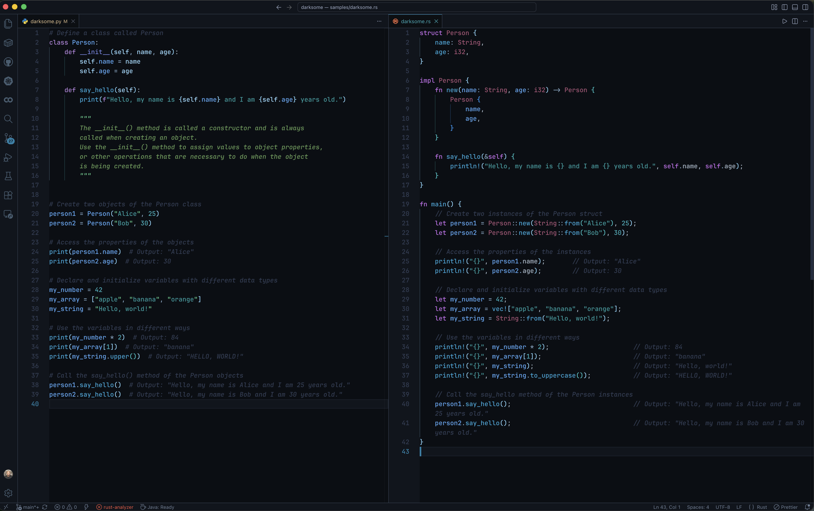
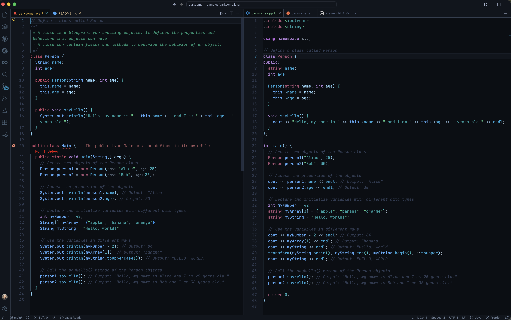
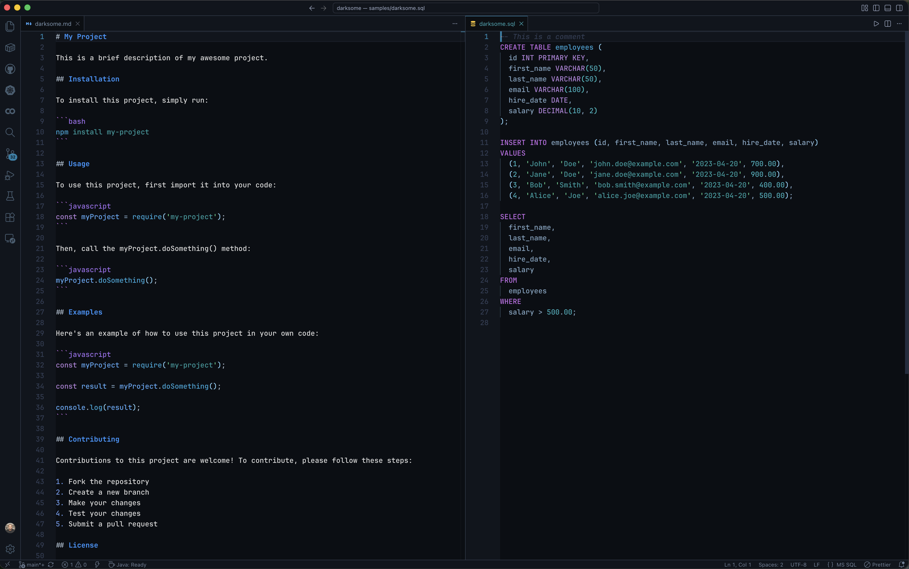
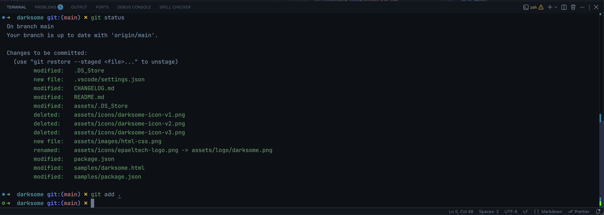

<p align="center">
  
</p>

<h1 align="center">Darksome</h1>

<p align="center">
  <em>A refined, high-contrast dark theme engineered for deep focus, long coding sessions, and visual elegance.</em>
</p>

<p align="center">
  <a href="https://marketplace.visualstudio.com/items?itemName=rochekollie.darksome"></a>
  <a href="https://marketplace.visualstudio.com/items?itemName=rochekollie.darksome"></a>
  <a href="https://marketplace.visualstudio.com/items?itemName=rochekollie.darksome"></a>
  <a href="./LICENSE"></a>
</p>

---

## Overview

**Darksome** is an intentional, distraction-free VS Code dark theme built for developers who care deeply about visual hierarchy and typographic clarity.

Version 2.0 introduces a ground-up redesign of both the workbench surface and the syntax colorization system. By pairing rich obsidian backgrounds (`#0a0e14`) with a disciplined palette of electric blue, ocean teal, soft violet, and muted slate, Darksome achieves optimal contrast without the harsh glare of stark white or the muddy fatigue of washed-out grays.

Whether you're debugging deep async stacks late into the night or architecting complex systems across multiple editor panes, Darksome keeps your code effortless to scan and comfortable to navigate.

---

## What Makes Darksome v2 Different?

- **Deep Obsidian & Slate Foundation**: An ultra-dark editor surface (`#0a0e14`) bordered by muted slate (`#333e4f`) and deep panel layers (`#10151d`, `#0c1117`) that anchor your eyes where the code lives.
- **Calibrated Semantic Hierarchy**:
  - **Functions & Methods** in crisp periwinkle and soft indigo (`#707dd5`, `#6f7ed7`, `#25a3d5`).
  - **Keywords & Types** in refined lavender and dusty rose (`#b181d7`, `#a75274`), with italicized import/export primitives.
  - **Strings & Object Keys** in soothing ocean teal (`#1c989b`, `#77d5a3`).
  - **Numbers & Units** in luminous cyan (`#2aabb8`, `#55aaf5`).
  - **Comments & JSDoc** in unobtrusive slate (`#303c53`) with emerald italic documentation highlights (`#1c8c6d`).
- **360° Workbench Polish**: 390+ meticulously tuned UI tokens spanning the Activity Bar, Editor Tabs, Status Bar, Breadcrumbs, Sticky Scroll, Notification Center, Inlay Hints, and Command Center.
- **Custom Terminal ANSI Palette**: Clean, high-legibility terminal colors matched to the theme's core identity.
- **Accessibility & Contrast First**: Carefully balanced luminance levels ensure long-term comfort while exceeding readability requirements.

---

## Gallery & Language Showcase

### HTML & CSS

Clean distinction between tags, classes, IDs, properties, values, and vendor prefixes.


### JavaScript & JSON

Crisp syntax highlighting for modern ES6+, arrow functions, object properties, and structured JSON data.


### React (JSX/TSX) & Vue

Distinct tag styling for native HTML elements and custom component declarations.


### Python & Rust

Elegant readability for Python type hints, decorators, docstrings, Rust lifetimes, and match expressions.


### Java & C++

Balanced styling for typed languages, object-oriented hierarchies, constructors, and member accesses.


### Markdown & SQL

Hierarchical headings, bold and italic accents, styled code fences, table blocks, and DML keywords.


### Integrated Terminal

Custom ANSI palette designed to make CLI tools, git prompts, and logs easy to read at a glance.


---

## Color Palette

| Swatch | Hex Code | Purpose |
| :---: | :--- | :--- |
|  | `#0a0e14` | Editor Canvas Background |
|  | `#10151d` | Activity Bar, Title Bar, Widget Background |
|  | `#0c1117` | Sidebar, Terminal, Menu Background |
|  | `#333e4f` | Borders, Dividers, Selection Outlines |
|  | `#1c989b` | Primary Accent, Strings, Object Keys |
|  | `#1d81a8` | Cursor, Tab Active Border, Active Indicators |
|  | `#2aabb8` | Numbers, Numeric Constants, Active Tabs |
|  | `#707dd5` | Functions, Methods, HTML Attributes |
|  | `#b181d7` | Keywords, Storage Modifiers, Control Flow |
|  | `#a75274` | Types, Classes, Import/Export Statements |
|  | `#303c53` | Inline Comments, Line Numbers |
|  | `#1c8c6d` | Documentation Comments & JSDoc |

---

## Installation

### Via VS Code Extension Marketplace

1. Open **Visual Studio Code**.
2. Press `Ctrl` + `P` (or `Cmd` + `P` on macOS) to open the Quick Open dialog.
3. Paste the following command and press `Enter`:

   ```shell
   ext install rochekollie.darksome
   ```

4. Press `Ctrl` + `K` `Ctrl` + `T` (or `Cmd` + `K` `Cmd` + `T` on macOS) to open the theme selector, and choose **Darksome**.

### Manual / GUI Installation

1. Open the Extensions sidebar (`Ctrl` + `Shift` + `X` or `Cmd` + `Shift` + `X`).
2. Search for **Darksome**.
3. Click **Install**.
4. Select **Darksome** when prompted to switch your color theme.

---

## Recommended Editor Settings

To experience Darksome at its best, consider pairing it with a font that supports programming ligatures and enabling sticky scroll:

```json
{
  "workbench.colorTheme": "Darksome",
  "editor.fontFamily": "'JetBrains Mono', 'Fira Code', 'Cascadia Code', monospace",
  "editor.fontLigatures": true,
  "editor.fontWeight": "500",
  "editor.cursorSmoothCaretAnimation": "on",
  "editor.smoothScrolling": true,
  "editor.stickyScroll.enabled": true,
  "workbench.tree.enableStickyScroll": true
}
```

---

## Release Notes

Detailed notes for every release are available in the [CHANGELOG.md](./CHANGELOG.md).

- **Version 2.0.0**: Complete overhaul of the theme palette, new high-contrast syntax highlighting, refined UI borders, 390+ workbench tokens, and updated branding.
- **Version 1.0.1**: Fixed documentation and license links.
- **Version 1.0.0**: Initial official release.

---

## Contributing & Support

Found an issue, missing syntax scope, or have a suggestion? We welcome community feedback:

- 🐛 [Report a bug or suggest a feature](https://github.com/rochekollie/darksome/issues)
- ⭐ If you enjoy Darksome, consider leaving a rating on the [VS Code Marketplace](https://marketplace.visualstudio.com/items?itemName=rochekollie.darksome)!

---

## License

Darksome is open-source software licensed under the [MIT License](./LICENSE).

Crafted with care by [Roche Kollie](https://github.com/rochekollie).
